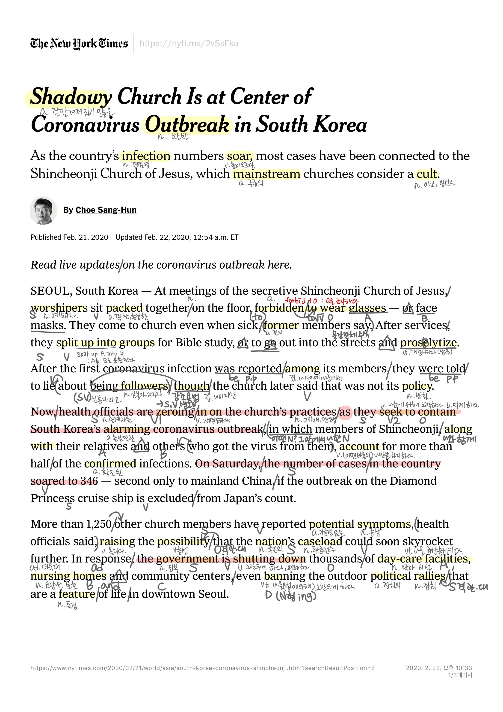

## READING

## LISTENING

* Adventure Time 1. ep 01.

## SENTENCE
* will the dead be filled with worms?
* we used to date
* the candy people are made of sugar, you ding-dong!
* I'm gonna make you spill your beans, Finn!
* Oh, thanks goodness!
* What the nuts happen here?
* Finn, you're terrible at math!
* I was too smart to see it.
* This is messed up, but sweet.
* Flesh is delicous.
* Don't squeeze me, I'll fart.

---
* https://nyti.ms/2vSsFka