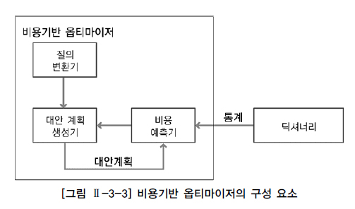
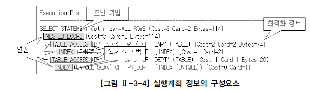

##  SQL Optimizer 이란?

SQL Optimizer가 무엇인지 직관적으로 받아들이기 위해 단어를 분리해 알아보자.

### SQL 이란?

SQL은 관계형 데이터베이스 관리 시스템(RDBMS)의 데이터를 관리하기 위해 설계된 특수 목적의 프로그래밍 언어를 말한다. 쉽게 풀이하자면 RDBMS에게 데이터에 관한 생성, 삭제, 조회 등의 조작들을 요청하는 말이라는 뜻이다.

### Optimizer 란?

Wiki에 Optimizer를 검색하면 다양한 Optimization들이 나온다. Optimization들을 보다보면 이 Optimizer들은 사용 분야에서 최적의 상태를 위해 발버둥치는 것들을 의미한다고 짐작할 수 있다.

### 그렇다면 SQL Optimizer은?

"RDBMS에 질의된 SQL을 최적화 해주는 것" 이라고 생각할 수 있고, 말 그대로 SQL Optimizer은 SQL을 가장 빠르고 효율적으로 수행할 최적(가장 낮은 비용=최저비용)의 실행 방법을 생성하고 결정하는 DBMS 내부의 핵심엔진을 말한다.

옵티마이저는 사용자가 SQL로 데이터를 요구하면 결과를 응답하기 위해 처리경로를 생성한다. 이 때 옵티마이저가 생성한 SQL 처리경로를 실행계획(Execution Plan)이라고 부른다.

## Optimizer의 종류

옵티마이저는 최적의 처리경로를 결정하는 방식에 따라 두 가지로 나뉜다. (현재 대부분의 RDBMS는 비용기반 옵티마이저만을 제공하고 규칙기반 옵티마이저를 제공하더라도 하위 버전 호환성을 위해서만 남아있다.)

1. 규칙기반 옵티마이저(Rule-Based Optimizer, RBO)  
   
   휴리스틱 옵티마이저(Heuristic Optimizer)라고도 하며, 정해 놓은 규칙(우선 순위)를 가지고 실행계획을 선택한다. 
   
   >우선순위를 결정하는 요인
   >* SQL문을 실행하기 위해서 이용 가능한 인덱스 유무(유일, 비유일, 단일, 복합 인덱스)와 종류
   >* SQL문에서 사용하는 연산자(=, <, <>, LIKE, BETWEEN, 등)의 종류
   >* SQL에서 참조하는 객체(힙 테이블, 클러스터 테이블 등)의 종류

2. 비용기반 옵티마이저(Cost Based Optimizer, CBO)  
  
   SQL문을 처리하는데 필요한 비용이 가장 적은 실행계획을 선택하는 방식이다.

   > 비용 예측에 사용되는 요인
   >* 테이블, 인덱스, 칼럼 등의 다양한 객체 통계정보
   >* 시스템 통계정보

   통계정보가 없는 경우 정확한 비용 예측이 불가능하기 때문에 정확한 통계정보를 유지하는 것이 중요한 요소이다.

   #### 비용기반 옵티마이저의 구성 요소
   * 질의 변환기(Query Transformer): Query Transformation을 담당함.
   * 비용 예측기(Estimator): 데이터 딕셔너리에 저장된 다양한 통계 정보를 이용해 선택도(Selectivity), 카디널리티(Cardinality), 비용(Cost)등의 예상치 값(Measure)들을 산정하는 역할을 수행함.
   * 대안 계획 생성기(Plan Generator): SQL에서 요구한 사항을 처리하기 위해 가능한 실행계획들을 생성한 후 Estimator의 도움을 받아 가장 낮은 비용을 갖는 하나를 선택하는 과정을 총괄함.
   

## 실행계획

### 실행계획(Execution Plan) 이란?

SQL에서 요구한 사항을 처리하기 위한 절차와 방법을 의미한다.

### 실행계획의 구성 요소

* 조인 순서(Join Order): 조인작업을 수행할 때 참조하는 테이블의 순서.
* 조인 기법(Join Method): 두 개의 테이블을 조인할 때 사용할 수 있는 방법.
   * NL Join, Hash Join, Sort Merge Join 등이 있음.
* 액세스 기법(Access Method): 하나의 테이블을 액세스할 때 사용할 수 있는 방법
   * 인덱스 스캔(Index Scan): 인덱스를 이용하여 테이블을 액세스.
   * 테이블 스캔(Full Table Scan): 테이블 전체를 모두 읽으면서 조건을 만족하는 행을 찾음.
* 최적화 정보(Optimization Information): 옵티마이저가 실행계획의 각 단계마다 예상되는 비용 사항을 표시한 것.
   * 비용 사항이 표시된다는 것은 비용기반 최적화 방식으로 생성했다는 것임.
   * 최적화 정보의 요소
      * Cost:상대적인 비용 정보.
      * Card:주어진 조건을 만족한 결과 집합 or 조인 조건을 만족한 결과 집합의 건수.
      * Bytes: 결과 집합이 차지하는 메모리 양.
* 연산(Operation): 여러 가지 조작을 통해 원하는 결과를 얻어내는 일련의 작업.
   * 조인 기법(NL Join, Hash Join, Sort Merge Join 등)
   * 액세스 기법(인덱스 스캔, 전체 테이블 스캔 등)
   * 필터, 정렬, 집계, 뷰 등

   

## 오라클 옵티마이저의 실행계획 수립

옵티마이저의 수행 단계는 기본적으로 Parse -> Execute -> Fetch 단계이다.

이 단계를 좀 더 자세히 나누면 다음과 같다.

1. Statement matching, syntactic and semantic checks
   * 해당 SQL이 라이브러리 캐시(Library Cache)에 이미 캐싱되어 있는지 확인하고, 구문(Syntax)검사와 의미(Semantic)검사를 수행하는 파싱 단계.
   * 쿼리 파서(Query Parser)가 실행함.
2. Query Transformation
   * 앞 단계의 수행결과인 Parse Tree를 분석해서 의미적으로 동일하면서도 더 나은 성능을 제공하는 형태로 재작성하는 단계.
   * 쿼리 옵티마이저(Query Optimizer)가 실행함.
3. Determine object costs and cardinalities
   * 각 오브젝트에 대한 액세스 방법과 비용을 계산하고 각 단계에서 반환되는 행의 수를 예측함.
   * 쿼리 옵티마이저(Query Optimizer)가 실행함.
4. Cost different join orders
   * 조인 순서와 조인 방법을 평가하고 총 비용이 가장 낮은 실행계획을 선택함.
   * 쿼리 옵티마이저(Query Optimizer)가 실행함.
5. Build structures for runtime
   * 런타임시 SQL 실행 엔진이 사용할 수 있는 데이터 구조체로 포맷팅하고 라이브러리 캐시에 캐싱함.
   * 로우-소스 제너레이터(Row-Source Generator)가 실행함.
6. Execution
   * 실행 엔진이 실행함.
7. Fetch
   * 어레이 패치(Array Fetch) 명령을 통해 결과를 사용자에게 전달함.

---
* http://www.gurubee.net/article/10134
* http://www.dbguide.net/db.db?cmd=view&boardUid=148208&boardConfigUid=9&categoryUid=216&boardIdx=136&boardStep=1
