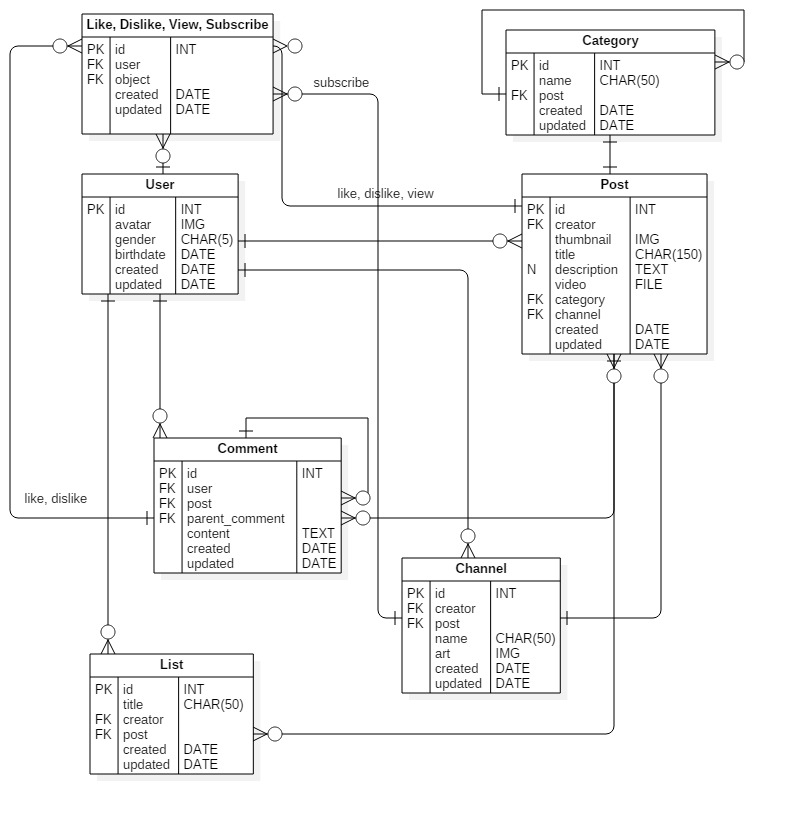

요즘 DRF에 대해 공부하고 있다. 그래서 공부하는 김에 프로젝트도 함께 진행해보자. 사실 깃허브 repository는 3일 전에 커밋했는데, 포토폴리오 수정이 끝이 보이지 않아서.. 이제서야 올린다.

## 프로젝트 목표

Youtube Clone을 DRF로 해보고자 한다. Django는 사용자와의 상호작용이 적고, 컨텐츠를 올리고 내리는 웹 서비스에 적합하다. 유튜브는 비교적 Django를 사용하기에 좋은 서비스인 것 같아 시도해보고자 한다.

## 프로젝트 기능 분석

* User가 CRUD 할 수 있다.
* User는 Channel을 CRUD 할 수 있다.
* User는 Channel에 Video Post를 CRUD 할 수 있다.
* User는 List를 CRUD 할 수 있다.
* User는 Post에 Comment를 CRUD 할 수 있다.

(Like, Dislike, View, Subscribe 등은 아직 미정.)

## Model & Class 설계

