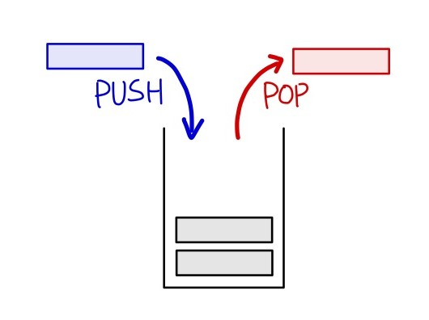
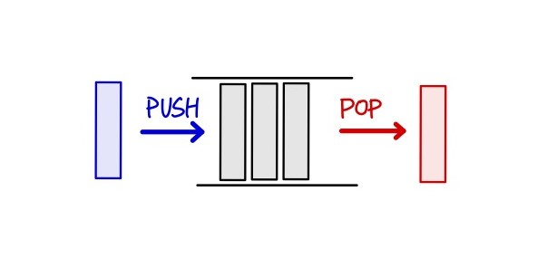
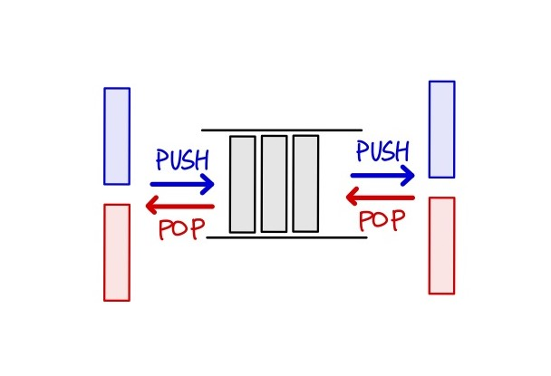

## 스택(Stack)



* 한쪽 끝에서만 자료를 넣고 뺄 수 있는 구조.
* 마지막으로 넣은 것이 가장 먼저 나옴(LIFO).
* 스택의 기능
    * push: 스택에 자료를 넣는 연산.
    * pop: 스택에 자료를 빼는 연산.
    * top: 스택의 가장 위에 있는 자료를 보는 연산.
    * empty: 스택이 비어있는지 아닌지를 알아보는 연산.
    * size: 스택에 저장되어 있는 자료의 개수를 알아보는 연산.

### 각 언어에서 스택 구현

* c++에서 `stack` 구현
```c++
struct Stack {

    int data[10000];
    int size;
    
    Stack(){
        size=0;
    }

    void push(int num){
        data[size] = num;
        size += 1;
    }

    bool empty(){
        if(size == 0)
            return true;
        else
            return false;
    }

    void pop(){
        if(empty())
            return -1;
        else
            size -= 1;
            return data[size];
    }

    int top(){
        if(empty())
            return -1;
        else
            return data[size-1];
    }
};
```

### 각 언어에서 스택 사용

* c++ 에서 `stack` 사용.
```c++
#include <stack>
using namespace std;

int main(){

    int tmp = 10;
    stack<int> s;

    s.push(tmp);
    s.pop();

    s.top();
    s.empty();
    s.size();

    return 0;
}
```

* python 에서 `stack` 사용.
* python 에서는 `list`가 스택과 같은 기능을 함.
    * c++에서 제공하는 기능 중 python에서 제공하지 않는 기능들이 있었음. 정확한 명칭이 stack이 아닌 list니까
    * stack 문제를 풀 때 size나 empty, top은 자주 사용하는 기능이므로 같은 기능을 할 수 있는 방법을 적어놓음.

```python3
>>> stack = [3, 4, 5]
>>> stack.append(6)
>>> stack
[3, 4, 5, 6]
>>> stack.pop()
6
>>> stack
[3, 4, 5]

# 없는 기능들
>>> def is_empty(s):
        if not s:
            return True
        else:
            return False

>>> stack[-1]
5
>>> is_empty(s)
False
>>> len(stack)
3
```

### 문제에서 보이는 스택의 특징
* LIFO
* 문제를 해결하는 방법에서 마지막으로 나오는 데이터의 값이 의미가 있는 연산이 반복됨.

## 큐(Queue)



* 한쪽 끝에서만 자료를 넣고 다른 한쪽 끝에서만 뺄 수 있는 자료구조.
* 먼저 넣은 것이 가장 먼저 나옴(FIFO).
* 큐에 포함되어 있는 내용은 [begin, end) => "begin은 포함하고, end는 포함하지 않음" 임.
* 큐의 기능
    * push: 큐에 자료를 넣는 연산.
    * pop: 큐에 자료를 빼는 연산.
    * front: 큐의 가장 앞에 있는 자료를 보는 연산.
    * back: 큐의 가장 뒤에 있는 자료를 보는 연산.
    * empty: 큐가 비었는지 아닌지를 알아보는 연산.
    * size: 큐에 저장되어 있는 자료의 개수를 알아보는 연산.

### 각 언어에서 큐 구현

* c++에서 `queue` 구현
```c++
struct Queue{

    int data[10000];
    int begin, end;

    Queue(){
        begin = 0;
        end = 0;
    }

    void push(int num){
        data[end] = num;
        end += 1;
    }

    bool empty(){
        if(begin == end)
            return true;
        else
            return false;
    }

    int size(){
        return end - begin;
    }

    int front(){
        return data[begin];
    }

    int back(){
        return data[end-1];
    }

    int pop(){
        if(empty())
            return -1;
        begin += 1;
        return data[begin-1];
    }
};
```

### 각 언어들에서 큐 사용

* c++ 에서 `queue` 사용.
```c++
#include <queue>
using namespace std;

int main(){

    int tmp=10;
    queue<int> q;

    q.push(tmp);
    q.pop();
    q.front();
    q.back();
    q.empty();
    q.size();

    return 0;
}
```

* python 에서 `queue` 사용.
* list는 queue의 역할을 하지 않으므로 `collections의 deque`를 사용.
    * c++에서 제공하는 기능 중 python에서 제공하지 않는 기능들이 있었음.
    * queue 문제를 풀 때 몇몇 기능은 자주 사용하므로 같은 기능을 할 수 있는 방법을 적어놓음.

```python3
>>> from collections import deque
>>> q = deque()
#왼쪽입력, 오른쪽출력, ->
>>> q.appendleft(3)
>>> q.appendleft(4)
>>> q.appendleft(5)
>>> q.appendleft(6)
>>> q
deque([6, 5, 4, 3])
>>> q.pop()
3
#오른쪽입력, 왼쪽출력, <-
>>> q.append(3)
>>> q.append(4)
>>> q.append(5)
>>> q.append(6)
>>> q
deque([3, 4, 5, 6])
>>> q.popleft()
3

#없는 기능들
>>> def is_empty(s):
        if not s:
            return True
        else:
            return False
>>> q[-1]
4
>>> q[0]
6
>>> is_empty(q)
False
>>> len(q)
```

### 문제에서 보이는 큐의 특징
* FIFO
* 문제를 해결하는 방법에서 작업을 순서대로 처리해야 할 때.

## 덱(Deque)



* 양 끝에서 모두 자료를 넣고, 뺄 수 있는 자료구조.
* Double-ended queue의 약자.
* 덱의 기능
    * push_front: 덱의 앞에 자료를 넣는 연산.
    * push_back: 덱의 뒤에 자료를 넣는 연산.
    * pop_front: 덱의 앞의 자료를 빼는 연산.
    * pop_back: 덱의 뒤의 자료를 빼는 연산.
    * front: 덱의 가장 앞에 있는 자료를 보는 연산.
    * back : 덱의 가장 뒤에 있는 자료를 보는 연산.

### 각 언어에서 덱 구현

* c++에서 `deque` 구현
```c++
struct Deque{

    int data[10000];
    int begin, end;

    Deque(){
        begin = 5000;
        end = 5000;
    }

    void push_front(int num){
        data[begin] = num;
        begin -= 1;
    }

    void push_back(int num){
        data[back] = num;
        back += 1;
    }

    bool empty(){
        if(begin == back)
            return true;
        else
            return false;
    }

    int pop_front(){
        if(empty())
            return -1;
        begin += 1;
        return data[begin];
    }

    int pop_back(){
        if(empty())
            return -1;
        end -= 1;
        return data[end+1];
    }

    int size(){
        return end - begin;
    }

    int front(){
        if(empty())
            return -1;
        return data[begin+1];
    }

    int back(){
        if(empty())
            return -1;
        return data[end-1];
    }
};
```

### 각 언어들에서 덱 사용

* c++에서 `deque` 사용
```c++
#include <deque>
using namespace std;

int main(){

    int tmp=10;
    deque<int> dq;

    dq.push_front(tmp);
    dq.push_back(tmp);
    dq.pop_front();
    dq.pop_back();
    dq.front();
    dq.back();

    return 0;
}
```

* python에서 `deque` 사용
* list는 queue의 역할을 하지 않으므로 `collections의 deque`를 사용.
    * c++에서 제공하는 기능 중 python에서 제공하지 않는 기능들이 있었음.
    * deque 문제를 풀 때 몇몇 기능은 자주 사용하므로 같은 기능을 할 수 있는 방법을 적어놓음.

```python3
>>> from collections import deque
>>> dq = deque()
#앞/왼쪽에서 입, 출력
>>> dq.appendleft(3)
>>> dq.appendleft(4)
>>> dq.appendleft(5)
>>> dq.appendleft(6)
>>> dq
deque([6, 5, 4, 3])
>>> dq.popleft()
6
#뒤/오른쪽에서 입, 출력
>>> dq.append(3)
>>> dq.append(4)
>>> dq.append(5)
>>> dq.append(6)
>>> dq
deque([3, 4, 5, 6])
>>> dq.pop()
6
#없는 기능들
>>> dq[0]
3
>>> dq[-1]
5
>>> len(dq)
3
```
